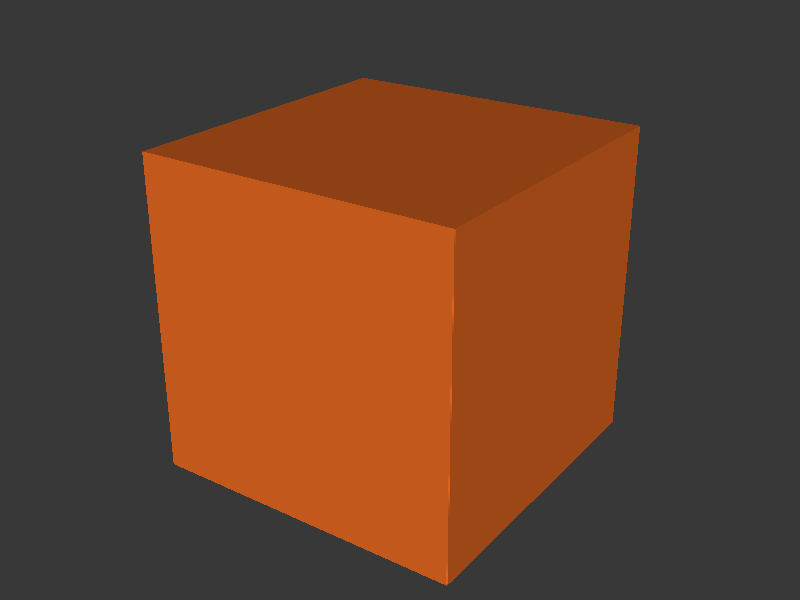

# Extrusion Multiplier



Generates a 40 mm cube, slices it in vase mode with classic perimeter
generator, and reports the expected wall thickness. Print the cube, measure
the wall with calipers, and calculate `EM = expected_width / measured_width`.

## Quick Start

Generate a PLA extrusion multiplier cube with default settings:

```bash
extrusion-multiplier --no-upload --output-dir ./output --keep-files
```

Upload directly to printer:

```bash
extrusion-multiplier \
  --printer-url http://192.168.1.100 \
  --api-key YOUR_API_KEY
```

## How It Works

1. **Model generation** — CadQuery builds a simple 40 mm cube (configurable
   with `--cube-size`).

2. **Slicing** — PrusaSlicer slices in `--spiral-vase` mode with
   `--perimeter-generator=classic` (required for accurate single-wall width),
   a 5 mm brim, and no supports.

3. **Expected width** — The tool prints the expected wall thickness (equal to
   the extrusion width, default 0.45 mm for a 0.4 mm nozzle).

4. **Upload** — Same PrusaLink upload path as the other tools.

## Interpreting the Print

Print the cube, then measure the wall thickness at several points with digital
calipers. Calculate: **EM = expected_width / measured_width**. For example, if
the expected width is 0.45 mm and you measure 0.47 mm, set
`EM = 0.45 / 0.47 = 0.957`. Apply this value in PrusaSlicer under
Filament Settings → Filament → Extrusion multiplier.

## CLI Reference

### Model Options

| Flag | Default | Description |
|------|---------|-------------|
| `--filament-type` | `PLA` | Filament type (preset name or custom) |
| `--cube-size` | `40.0` | Cube size in mm |

### Nozzle Options

| Flag | Default | Description |
|------|---------|-------------|
| `--nozzle-size` | `0.4` | Nozzle diameter in mm — derives layer height (`nozzle × 0.5`) and extrusion width (`nozzle × 1.125`) |

### Slicer Options

| Flag | Default | Description |
|------|---------|-------------|
| `--nozzle-temp` | from preset | Nozzle temperature (deg C) — overrides preset |
| `--bed-temp` | from preset | Bed temperature (deg C) — overrides preset |
| `--fan-speed` | from preset | Fan speed (0--100%) — overrides preset |
| `--layer-height` | from `--nozzle-size` | Slicer layer height in mm (default: nozzle × 0.5) |
| `--extrusion-width` | from `--nozzle-size` | Slicer extrusion width in mm (default: nozzle × 1.125) |
| `--config-ini` | | PrusaSlicer `.ini` config file |
| `--prusaslicer-path` | auto-detect | Path to PrusaSlicer executable |
| `--printer` | `COREONE` | Printer model — auto-sets bed center/shape and embeds printer metadata in bgcode |
| `--bed-center` | from `--printer` | Bed centre as X,Y in mm (auto-set by `--printer`) |
| `--extra-slicer-args` | | Additional PrusaSlicer CLI args (must be last) |

Supported printers for `--printer`: **COREONE**, **COREONEL**, **MK4S**
(alias: MK4), **MINI**, **XL**.

### Printer Options

| Flag | Default | Description |
|------|---------|-------------|
| `--printer-url` | | PrusaLink URL (e.g. `http://192.168.1.100`) |
| `--api-key` | | PrusaLink API key |
| `--no-upload` | `false` | Skip uploading to printer |
| `--print-after-upload` | `false` | Start printing after upload |

### Output Options

| Flag | Default | Description |
|------|---------|-------------|
| `--output-dir` | temp dir | Directory for output files |
| `--keep-files` | `false` | Keep intermediate STL and raw G-code |
| `--ascii-gcode` | `false` | Output ASCII `.gcode` instead of binary `.bgcode` |
| `--config` | auto-detect | Path to a TOML config file |
| `-v`, `--verbose` | `false` | Show detailed debug output |

## Examples

PETG with custom temperature:

```bash
extrusion-multiplier --filament-type PETG --nozzle-temp 240 --no-upload
```

With a 0.6mm nozzle (auto-sets 0.3mm layer height, 0.68mm extrusion width):

```bash
extrusion-multiplier --nozzle-size 0.6 --no-upload
```

Custom cube size:

```bash
extrusion-multiplier --cube-size 30 --no-upload
```
