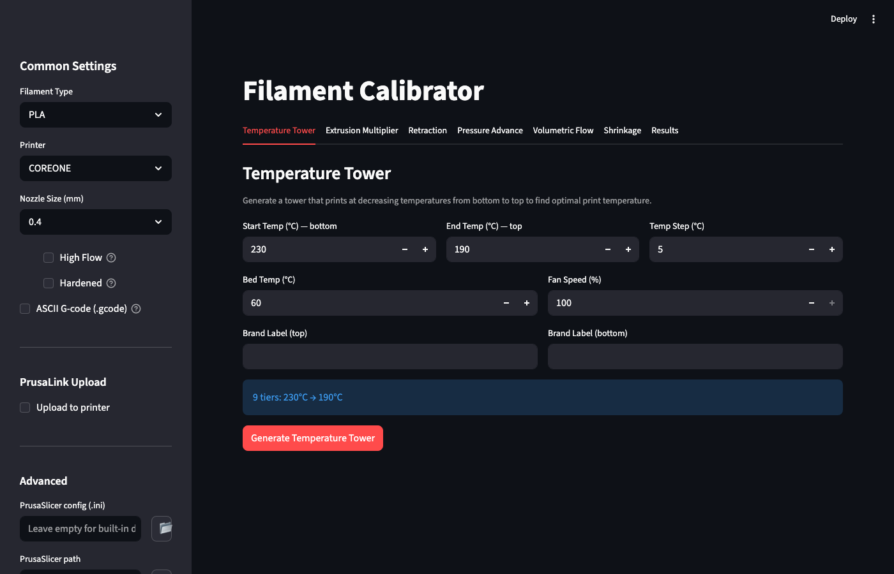
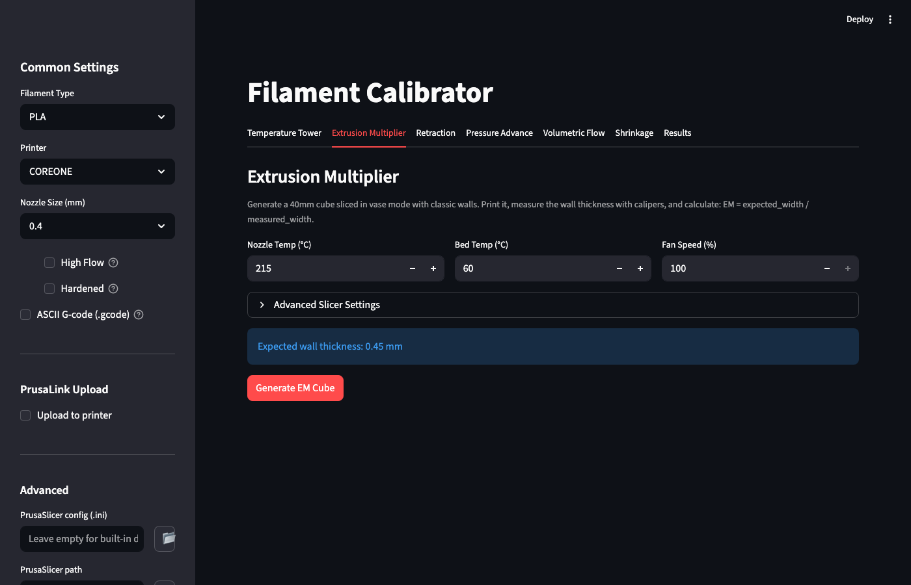
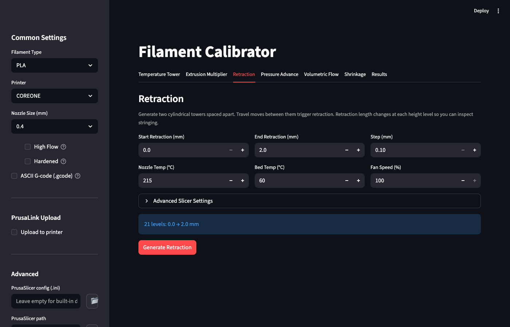
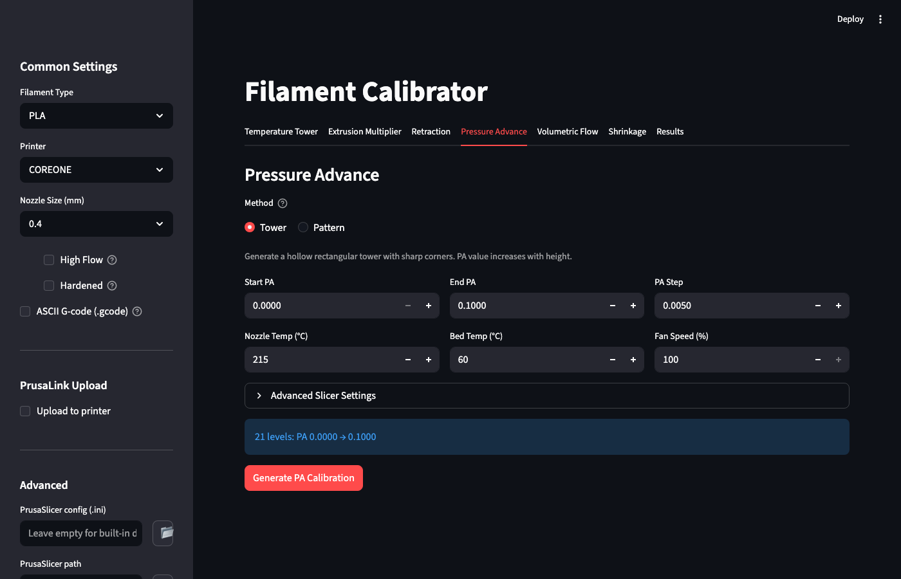
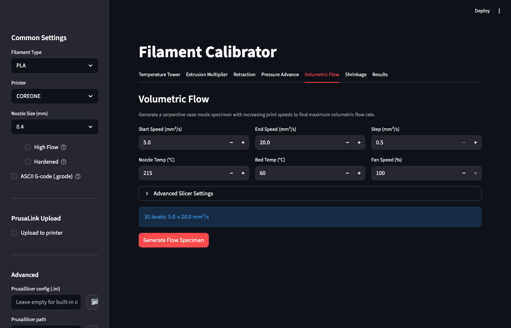
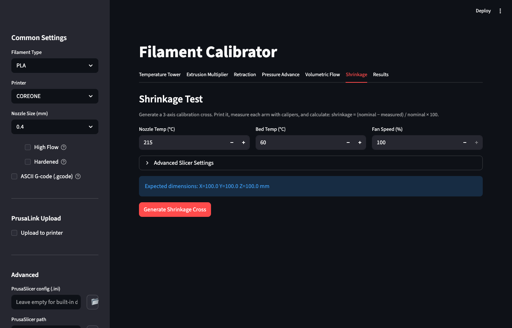
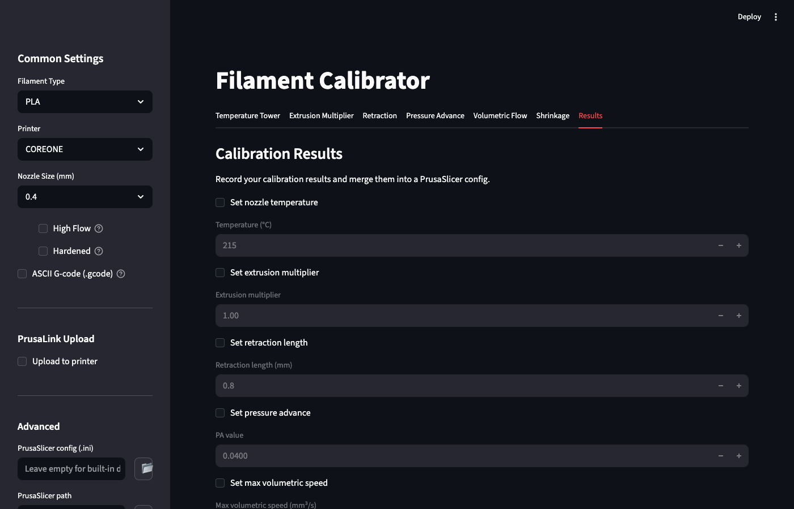

[← Back to README](../README.md)

# GUI


The browser-based GUI wraps all six calibration tools into a single
Streamlit interface with shared settings, per-tool tabs, and a Results tab
for merging calibration values into a PrusaSlicer config.

## Quick Start

```bash
# Install with GUI extra
uv tool install "filament-calibrator[gui]" --python 3.12
# or: pip install "filament-calibrator[gui]"

# Launch
filament-calibrator-gui
```

The GUI opens in your default browser at `http://localhost:8501`.  To
access it from another machine on the same network (e.g. when running on a
Raspberry Pi), use the Network URL shown in the terminal output.

## Sidebar: Common Settings

The sidebar is visible on every tab and controls settings shared across all
calibration tools.

### Filament & Printer

- **Filament Type** — dropdown of known presets (PLA, PETG, ABS, ASA, TPU,
  etc.).  Changing the filament type updates default temperatures, bed temp,
  and fan speed across all tabs.
- **Printer** — dropdown of supported printers (COREONE, COREONEL, MK4S,
  MINI, XL).  Sets bed geometry and printer-specific G-code.
- **Nozzle Size** — dropdown (0.25, 0.3, 0.4, 0.5, 0.6, 0.8 mm).
  Automatically derives layer height (`nozzle × 0.5`) and extrusion width
  (`nozzle × 1.125`) for all tabs.
  - **High Flow** — marks the nozzle as a high-flow variant.
  - **Hardened** — marks the nozzle as hardened/abrasive-resistant.
- **ASCII G-code (.gcode)** — toggle between binary `.bgcode` (default,
  with thumbnail previews) and plain-text `.gcode` output.

### PrusaLink Upload

- **Upload to printer** — enable to show upload settings.
- **Printer URL** — PrusaLink address (e.g. `http://192.168.1.100`).
- **API Key** — PrusaLink API key (masked password field).

When enabled, a confirmation dialog appears after each successful generation
with the printer URL, filename, file size, and a "Print after upload"
checkbox.

### Advanced

- **PrusaSlicer config (.ini)** — path to an exported PrusaSlicer profile.
  Loading an `.ini` auto-populates temperatures, layer height, extrusion
  width, nozzle size, and printer across all tabs.
- **PrusaSlicer path** — override auto-detection of the PrusaSlicer
  executable.  Leave empty to search your PATH.
- **Output directory** — where generated G-code files are saved.  Defaults
  to a temporary directory.

All three fields have a browse button that opens a native file dialog.

## Config Auto-Populate

If a `filament-calibrator.toml` config file exists (see
[Configuration](configuration.md)), the GUI loads it on first launch and
pre-fills sidebar fields (printer URL, API key, filament type, nozzle size,
printer, output directory, PrusaSlicer paths).

Similarly, loading a PrusaSlicer `.ini` in the Advanced section parses it
and pushes values (temperatures, layer height, extrusion width, nozzle
diameter, printer model, filament type) into all tab fields.

## Calibration Tabs

The main area has seven tabs.  The first six each generate a calibration
print; the seventh merges results into a slicer config.  Every generation
tab follows the same pattern:

1. **Form fields** — configure the calibration parameters.
2. **Info bar** — a blue bar showing computed values (tier count, level
   count, expected dimensions).
3. **Generate button** — runs the full pipeline (model → slice → G-code
   processing).
4. **Results area** — appears after generation with a download button, 3D
   model preview, optional PrusaLink upload, and a collapsible pipeline log.

### Temperature Tower



| Field | Description |
|-------|-------------|
| Start Temp (°C) — bottom | Highest temperature, printed at the base of the tower |
| End Temp (°C) — top | Lowest temperature, printed at the top |
| Temp Step (°C) | Temperature decrease per tier |
| Bed Temp (°C) | Heated bed temperature |
| Fan Speed (%) | Part cooling fan percentage |
| Brand Label (top / bottom) | Optional text engraved on the tower |

The info bar shows the computed tier count and range
(e.g. _"9 tiers: 230°C → 190°C"_).

See [Temperature Tower](temperature-tower.md) for how to interpret the
printed tower.

### Extrusion Multiplier



| Field | Description |
|-------|-------------|
| Nozzle Temp (°C) | Printing temperature |
| Bed Temp (°C) | Bed temperature |
| Fan Speed (%) | Part cooling fan percentage |

**Advanced Slicer Settings** (click to expand):

| Field | Description |
|-------|-------------|
| Cube Size (mm) | Side length of the calibration cube (default 40) |
| Layer Height (mm) | Derived from nozzle size, overridable |
| Extrusion Width (mm) | Derived from nozzle size, overridable |

The info bar shows the expected single-wall thickness.  After printing,
measure the actual wall with calipers and calculate:
`EM = expected / measured`.

See [Extrusion Multiplier](extrusion-multiplier.md) for the full
calibration procedure.

### Retraction



| Field | Description |
|-------|-------------|
| Start Retraction (mm) | Minimum retraction length |
| End Retraction (mm) | Maximum retraction length |
| Step (mm) | Retraction increment per level |
| Nozzle Temp (°C) | Printing temperature |
| Bed Temp (°C) | Bed temperature |
| Fan Speed (%) | Part cooling fan percentage |

**Advanced Slicer Settings**: Level Height, Layer Height, Extrusion Width.

The info bar shows the computed level count.

See [Retraction Test](retraction-test.md) for how to inspect stringing
at each height.

### Pressure Advance



A **Method** radio button at the top selects between:

- **Tower** — hollow rectangular tower; PA value increases with height.
- **Pattern** — nested chevron outlines; PA varies by X position.

| Field | Description |
|-------|-------------|
| Start PA | Starting pressure advance value |
| End PA | Ending pressure advance value |
| PA Step | PA increment per level or pattern |
| Nozzle Temp (°C) | Printing temperature |
| Bed Temp (°C) | Bed temperature |
| Fan Speed (%) | Part cooling fan percentage |

When **Pattern** is selected, an additional **Pattern Settings** expander
appears with: Corner Angle, Arm Length, Wall Count, Number of Layers,
Frame Layers, Pattern Spacing, and Frame Offset.

**Advanced Slicer Settings**: Level Height (tower only), Layer Height,
Extrusion Width.

The info bar shows the computed level or pattern count.

See [Pressure Advance](pressure-advance.md) for how to read corner
quality.

### Volumetric Flow



| Field | Description |
|-------|-------------|
| Start Speed (mm³/s) | Starting volumetric flow rate |
| End Speed (mm³/s) | Ending volumetric flow rate |
| Step (mm³/s) | Flow rate increment per level |
| Nozzle Temp (°C) | Printing temperature |
| Bed Temp (°C) | Bed temperature |
| Fan Speed (%) | Part cooling fan percentage |

**Advanced Slicer Settings**: Level Height, Layer Height, Extrusion Width.

The info bar shows the computed level count.

See [Volumetric Flow](volumetric-flow.md) for how to identify the
maximum flow rate.

### Shrinkage



| Field | Description |
|-------|-------------|
| Nozzle Temp (°C) | Printing temperature |
| Bed Temp (°C) | Bed temperature |
| Fan Speed (%) | Part cooling fan percentage |

**Advanced Slicer Settings**: Arm Length, Layer Height, Extrusion Width.

The info bar shows the expected X, Y, and Z dimensions of the cross
specimen.

See [Shrinkage Test](shrinkage.md) for the measurement and calculation
procedure.

## Generation Results

After clicking a Generate button, the pipeline runs with a spinner.  When
it finishes:

- **Status banner** — green "Pipeline completed!" on success, or red
  "Pipeline failed!" on error.
- **Download button** — downloads the generated `.bgcode` or `.gcode`
  file directly from the browser.
- **Model preview** — a rendered 3D view of the generated STL specimen.
- **Upload to Printer** — if PrusaLink is configured in the sidebar, a
  confirmation dialog shows the printer URL, filename, file size, and a
  "Print after upload" checkbox with Upload and Skip buttons.
- **Pipeline log** — a collapsible section showing the full stdout/stderr
  output from model generation and slicing.  Expanded by default on
  failure to help with troubleshooting.

## Results Tab



After printing and inspecting each calibration specimen, record your
measured values in the Results tab.  Each value has a checkbox to
include or exclude it:

| Checkbox | Field | Description |
|----------|-------|-------------|
| Set nozzle temperature | Temperature (°C) | Optimal temp from the temperature tower |
| Set extrusion multiplier | EM value | Calculated EM from the cube test |
| Set retraction length | Retraction (mm) | Best retraction distance from the tower |
| Set pressure advance | PA value | Optimal PA from the tower or pattern test |
| Set max volumetric speed | Speed (mm³/s) | Max flow rate from the flow test |

When at least one value is checked, a **Changes** summary appears showing
what will be written.

If a PrusaSlicer `.ini` config is loaded in the sidebar, a **Download**
button appears to download the merged config file
(`<original>_calibrated.ini`) with your calibration results applied.

## Recommended Calibration Order

For best results, run the tools in this order:

1. **Temperature Tower** — find the optimal printing temperature first.
2. **Volumetric Flow** — determine the maximum flow rate at that temperature.
3. **Pressure Advance** — tune PA at the chosen temperature.
4. **Retraction** — find the optimal retraction distance.
5. **Extrusion Multiplier** — fine-tune extrusion with all other values set.
6. **Shrinkage** — measure dimensional accuracy last, after all other tuning.

After each test, enter the result in the **Results** tab.  When all values
are recorded, download the merged `.ini` config and import it into
PrusaSlicer.
