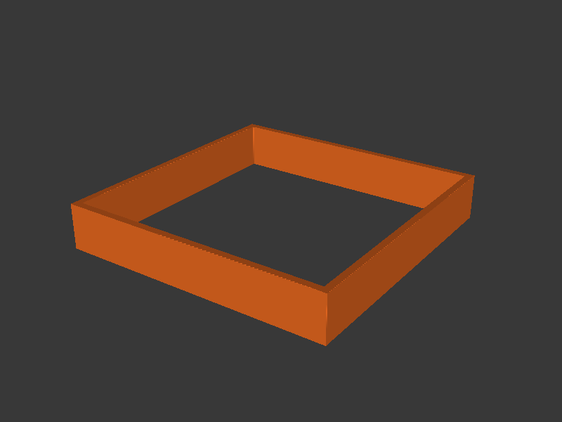
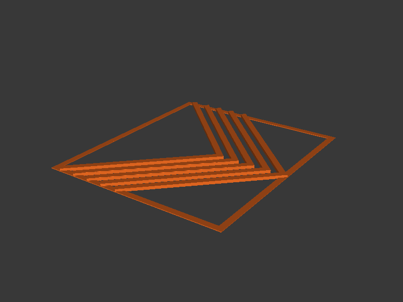

# Pressure Advance

Two methods for finding the optimal PA/Linear Advance value: **tower**
(default) generates a hollow tower with sharp corners where PA varies by
height; **pattern** generates nested chevron outlines where PA varies by X
position.

## Quick Start

Test PA from 0.0 to 0.10 in 0.01 steps (direct drive extruder):

```bash
pressure-advance \
  --start-pa 0 --end-pa 0.10 --pa-step 0.01 \
  --no-upload --output-dir ./output --keep-files
```

Upload directly to printer:

```bash
pressure-advance \
  --start-pa 0 --end-pa 0.10 --pa-step 0.01 \
  --printer-url http://192.168.1.100 \
  --api-key YOUR_API_KEY
```

## How It Works

Two calibration methods are available via `--method`:

### Tower method (default)



1. **Model generation** — CadQuery builds a hollow rectangular tower (60×60 mm,
   1.6 mm wall thickness) with perfectly sharp 90° corners. The tower height
   equals `num_levels × level_height`. Sharp corners are critical — they reveal
   PA tuning quality at each level.

2. **Slicing** — PrusaSlicer CLI slices the STL using either a user-supplied
   `.ini` profile or built-in defaults (2 perimeters, 0% infill, no top/bottom
   solid layers). Layer height and extrusion width are derived from
   `--nozzle-size`.

3. **PA command insertion** — Pressure advance (`M900 K<value>`) commands are
   inserted at the G-code layer boundaries corresponding to each level.

### Pattern method



1. **Model generation** — CadQuery builds nested chevron (V-shape) outlines
   inside a rectangular frame, with embossed PA value labels. Each chevron is
   printed at a different PA value.

2. **Slicing** — PrusaSlicer slices with the wall count matching the pattern
   config (default 3 walls).

3. **PA command insertion** — PA commands are inserted based on X position
   (by chevron tip location) rather than Z height.

## Interpreting the Print

**Tower:** Examine the corners at each level. The level with the sharpest
corners (no bulging, no rounding) is your optimal PA value. The tool prints a
lookup table mapping Z heights to PA values.

**Pattern:** Inspect which chevron has the sharpest corners. The PA value
is embossed next to each chevron for easy identification.

## CLI Reference

### Pressure Advance Options

| Flag | Default | Description |
|------|---------|-------------|
| `--start-pa` | *required* | Starting PA value (bottom level / first chevron) |
| `--end-pa` | *required* | Ending PA value (top level / last chevron) |
| `--pa-step` | *required* | PA value increment per level |
| `--method` | `tower` | Calibration method: `tower` or `pattern` |

The PA range must be evenly divisible by `--pa-step`, and the resulting number
of levels cannot exceed 50. `--start-pa` must be non-negative.

### Model Options

| Flag | Default | Description |
|------|---------|-------------|
| `--filament-type` | `PLA` | Filament type — sets nozzle temp, bed temp, and fan speed from preset |
| `--level-height` | `1.0` | Height per PA level in mm (tower method only) |

### Pattern Method Options

These flags apply only when `--method pattern` is used:

| Flag | Default | Description |
|------|---------|-------------|
| `--corner-angle` | `90.0` | Full angle at the chevron tip in degrees |
| `--arm-length` | `40.0` | Length of each chevron arm in mm |
| `--wall-count` | `3` | Number of concentric perimeter walls |
| `--num-layers` | `4` | Number of layers (height = num_layers × layer_height) |
| `--pattern-spacing` | `1.6` | Perpendicular gap between chevron arms in mm |
| `--frame-offset` | `3.0` | Distance from outermost chevron to frame edge in mm |

### Nozzle Options

| Flag | Default | Description |
|------|---------|-------------|
| `--nozzle-size` | `0.4` | Nozzle diameter in mm — derives layer height and extrusion width |

### Slicer Options

| Flag | Default | Description |
|------|---------|-------------|
| `--nozzle-temp` | from preset | Nozzle temperature (deg C) — overrides preset |
| `--bed-temp` | from preset | Bed temperature (deg C) — overrides preset |
| `--fan-speed` | from preset | Fan speed (0--100%) — overrides preset |
| `--layer-height` | from `--nozzle-size` | Slicer layer height in mm (default: nozzle × 0.5) |
| `--extrusion-width` | from `--nozzle-size` | Slicer extrusion width in mm (default: nozzle × 1.125) |
| `--config-ini` | | PrusaSlicer `.ini` config file |
| `--prusaslicer-path` | auto-detect | Path to PrusaSlicer executable |
| `--printer` | `COREONE` | Printer model — generates start/end G-code, auto-sets bed center/shape, and embeds printer metadata in bgcode (see below) |
| `--bed-center` | from `--printer` | Bed centre as X,Y in mm (auto-set by `--printer`) |
| `--extra-slicer-args` | | Additional PrusaSlicer CLI args (must be last) |

### Printer-Specific Start/End G-code

When `--printer` is specified and no `--config-ini` is given, the tool
renders printer-specific start and end G-code and passes it to PrusaSlicer.
This eliminates the need for a separate slicer profile and produces ready-to-
print output with proper homing, mesh bed leveling, and parking sequences.

Supported printers: **COREONE**, **COREONEL**, **MK4S** (alias: MK4),
**MINI**, **XL**.

The `--printer` flag also auto-sets `--bed-center` from the printer's known
bed dimensions (you can still override with an explicit `--bed-center`).

The start G-code includes mesh bed leveling at a safe probing temperature
(170 deg C or hotend temp, whichever is lower) and cooling fan during MBL for
PLA-like filaments (disabled for filaments requiring an enclosure like ABS/ASA).

### Printer Options

| Flag | Default | Description |
|------|---------|-------------|
| `--printer-url` | | PrusaLink URL (e.g. `http://192.168.1.100`) |
| `--api-key` | | PrusaLink API key |
| `--no-upload` | `false` | Skip uploading to printer |
| `--print-after-upload` | `false` | Start printing after upload |

### Output Options

| Flag | Default | Description |
|------|---------|-------------|
| `--output-dir` | temp dir | Directory for output files |
| `--keep-files` | `false` | Keep intermediate STL and raw G-code |
| `--ascii-gcode` | `false` | Output ASCII `.gcode` instead of binary `.bgcode` |
| `--config` | auto-detect | Path to a TOML config file |
| `-v`, `--verbose` | `false` | Show detailed debug output |

## Examples

Direct drive extruder (typical PA range 0.02--0.10):

```bash
pressure-advance \
  --start-pa 0 --end-pa 0.10 --pa-step 0.01 \
  --no-upload --output-dir ./output
```

With printer-specific G-code for Prusa Core One:

```bash
pressure-advance \
  --start-pa 0 --end-pa 0.10 --pa-step 0.01 \
  --printer coreone \
  --no-upload --output-dir ./output
```

Bowden extruder (typical PA range 0.3--1.0):

```bash
pressure-advance \
  --start-pa 0.3 --end-pa 1.0 --pa-step 0.05 \
  --no-upload --output-dir ./output
```

PETG with custom temperatures:

```bash
pressure-advance \
  --start-pa 0 --end-pa 0.10 --pa-step 0.01 \
  --filament-type PETG \
  --nozzle-temp 240 --bed-temp 80 \
  --no-upload
```

With a 0.6mm nozzle (auto-sets 0.3mm layer height, 0.68mm extrusion width):

```bash
pressure-advance \
  --start-pa 0 --end-pa 0.10 --pa-step 0.01 \
  --nozzle-size 0.6 \
  --no-upload
```

Pattern method (chevron shapes instead of tower):

```bash
pressure-advance \
  --method pattern \
  --start-pa 0 --end-pa 0.10 --pa-step 0.005 \
  --no-upload --output-dir ./output
```

MK4S with ABS filament:

```bash
pressure-advance \
  --start-pa 0 --end-pa 0.08 --pa-step 0.01 \
  --printer mk4s --filament-type ABS \
  --no-upload --output-dir ./output
```
