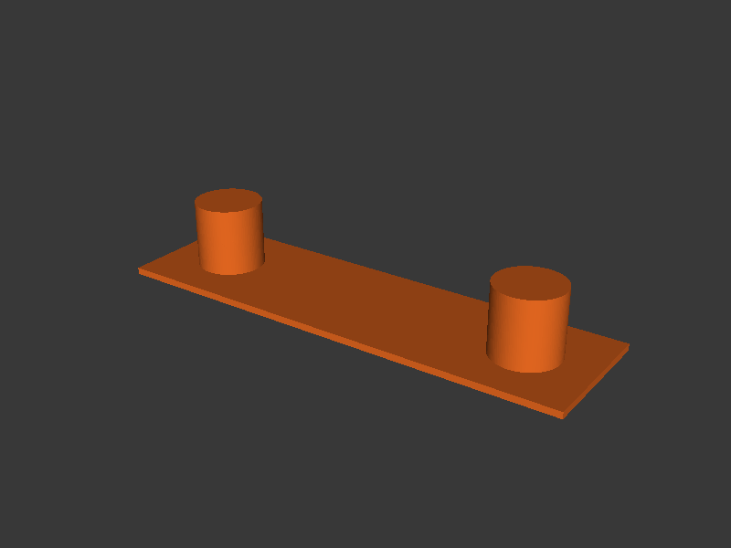

[← Back to README](../README.md)

# Retraction Test



Generates two cylindrical towers spaced apart so that PrusaSlicer's travel
moves between them trigger retraction. At each height level the firmware
retraction length is changed via `M207 S<length>`, so the user can inspect
stringing at each height to find the optimal retraction distance.

## Quick Start

Test retraction from 0.0 to 2.0 mm in 0.1 mm steps:

```bash
retraction-test \
  --start-retraction 0 --end-retraction 2.0 --retraction-step 0.1 \
  --no-upload --output-dir ./output --keep-files
```

Upload directly to printer:

```bash
retraction-test \
  --start-retraction 0 --end-retraction 2.0 --retraction-step 0.1 \
  --printer-url http://192.168.1.100 \
  --api-key YOUR_API_KEY
```

## How It Works

1. **Model generation** — CadQuery builds two cylindrical towers on a shared
   rectangular base, spaced apart to force travel moves between them.

2. **Slicing** — PrusaSlicer slices with `--use-firmware-retraction` so it
   emits G10/G11 commands instead of explicit retract moves. This allows M207
   commands to control the retraction length at runtime.

3. **Retraction command insertion** — `M207 S<length>` commands are inserted
   at the G-code layer boundaries corresponding to each level, so the
   firmware retraction length changes as the print progresses upward.

4. **Upload** — Same PrusaLink upload path as the other tools.

## Interpreting the Print

Inspect the stringing between the two towers at each height level. The level
with the least stringing (clean travel moves, no wisps) indicates your optimal
retraction distance. The tool prints a lookup table mapping Z heights to
retraction lengths.

## CLI Reference

### Retraction Options

| Flag | Default | Description |
|------|---------|-------------|
| `--start-retraction` | `0.0` | Starting retraction length in mm |
| `--end-retraction` | `2.0` | Ending retraction length in mm |
| `--retraction-step` | `0.1` | Retraction length increment per level in mm |

The retraction range must be evenly divisible by `--retraction-step`, and the
resulting number of levels cannot exceed 50. `--start-retraction` must be
non-negative and `--end-retraction` must be greater than `--start-retraction`.

### Model Options

| Flag | Default | Description |
|------|---------|-------------|
| `--filament-type` | `PLA` | Filament type — sets nozzle temp, bed temp, and fan speed from preset |
| `--level-height` | `1.0` | Height per retraction level in mm |

### Nozzle Options

| Flag | Default | Description |
|------|---------|-------------|
| `--nozzle-size` | `0.4` | Nozzle diameter in mm — derives layer height (`nozzle × 0.5`) and extrusion width (`nozzle × 1.125`) |

### Slicer Options

| Flag | Default | Description |
|------|---------|-------------|
| `--nozzle-temp` | from preset | Nozzle temperature (deg C) — overrides preset |
| `--bed-temp` | from preset | Bed temperature (deg C) — overrides preset |
| `--fan-speed` | from preset | Fan speed (0--100%) — overrides preset |
| `--layer-height` | from `--nozzle-size` | Slicer layer height in mm (default: nozzle × 0.5) |
| `--extrusion-width` | from `--nozzle-size` | Slicer extrusion width in mm (default: nozzle × 1.125) |
| `--config-ini` | | PrusaSlicer `.ini` config file |
| `--prusaslicer-path` | auto-detect | Path to PrusaSlicer executable |
| `--printer` | `COREONE` | Printer model — auto-sets bed center/shape and embeds printer metadata in bgcode |
| `--bed-center` | from `--printer` | Bed centre as X,Y in mm (auto-set by `--printer`) |
| `--extra-slicer-args` | | Additional PrusaSlicer CLI args (must be last) |

Supported printers for `--printer`: **COREONE**, **COREONEL**, **MK4S**
(alias: MK4), **MINI**, **XL**.

### Printer Options

| Flag | Default | Description |
|------|---------|-------------|
| `--printer-url` | | PrusaLink URL (e.g. `http://192.168.1.100`) |
| `--api-key` | | PrusaLink API key |
| `--no-upload` | `false` | Skip uploading to printer |
| `--print-after-upload` | `false` | Start printing after upload |

### Output Options

| Flag | Default | Description |
|------|---------|-------------|
| `--output-dir` | temp dir | Directory for output files |
| `--keep-files` | `false` | Keep intermediate STL and raw G-code |
| `--ascii-gcode` | `false` | Output ASCII `.gcode` instead of binary `.bgcode` |
| `--config` | auto-detect | Path to a TOML config file |
| `-v`, `--verbose` | `false` | Show detailed debug output |

## Examples

Direct drive retraction test (typical range 0--2 mm):

```bash
retraction-test \
  --start-retraction 0 --end-retraction 2.0 --retraction-step 0.1 \
  --no-upload --output-dir ./output
```

Bowden extruder (typical range 2--8 mm):

```bash
retraction-test \
  --start-retraction 2.0 --end-retraction 8.0 --retraction-step 0.5 \
  --no-upload --output-dir ./output
```

PETG with custom temperatures:

```bash
retraction-test \
  --start-retraction 0 --end-retraction 3.0 --retraction-step 0.2 \
  --filament-type PETG \
  --nozzle-temp 240 --bed-temp 80 \
  --no-upload
```

With a 0.6mm nozzle:

```bash
retraction-test \
  --start-retraction 0 --end-retraction 2.0 --retraction-step 0.1 \
  --nozzle-size 0.6 \
  --no-upload
```
