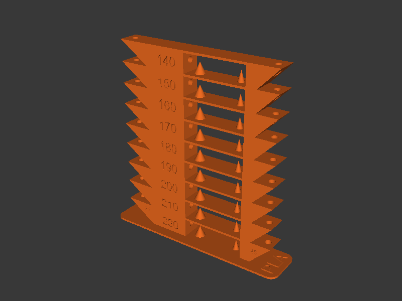

[← Back to README](../README.md)

# Temperature Tower



Generates a parametric temperature tower, slices it with PrusaSlicer, injects
per-tier temperature changes into the G-code, and optionally uploads the
result to your printer via PrusaLink.

## Quick Start

Generate and upload a PLA temperature tower with preset defaults:

```bash
temperature-tower \
  --printer-url http://192.168.1.100 \
  --api-key YOUR_API_KEY
```

Generate without uploading:

```bash
temperature-tower --no-upload --output-dir ./output --keep-files
```

## How It Works

1. **Model generation** — CadQuery builds a parametric temp tower STL matching
   the classic OpenSCAD design: filleted base, stacked tiers with overhang
   tests (45/35 deg), bridge holes, cones, and engraved temperature labels.

2. **Slicing** — PrusaSlicer CLI slices the STL using either a user-supplied
   `.ini` profile or built-in defaults (layer height and extrusion width
   derived from `--nozzle-size`, 2 perimeters, 15% infill, no supports).

3. **Temperature insertion** — `M104` commands are inserted at the G-code
   layer boundaries corresponding to each tier, so the printer changes
   temperature as it moves up the tower.

4. **Upload** — The final G-code is uploaded to the printer via PrusaLink
   REST API, with optional auto-start.

## CLI Reference

### Model Options

| Flag | Default | Description |
|------|---------|-------------|
| `--filament-type` | `PLA` | Filament type (preset name or custom) |
| `--start-temp` | from preset `temp_max` | Highest temperature (bottom tier) |
| `--end-temp` | from preset `temp_min` | Lowest temperature (top tier) |
| `--temp-step` | `5` | Temperature decrease per tier (deg C) |
| `--brand-top` | | Optional brand label on top |
| `--brand-bottom` | | Optional brand label on bottom |

Tier count is computed automatically: `(start_temp - end_temp) / temp_step + 1`,
validated to a maximum of 10. Temperatures must be within 150--350 deg C,
`--start-temp` must be at least `--end-temp + --temp-step`, and the range
must be evenly divisible by `--temp-step`.

### Nozzle Options

| Flag | Default | Description |
|------|---------|-------------|
| `--nozzle-size` | `0.4` | Nozzle diameter in mm — derives layer height (`nozzle × 0.5`) and extrusion width (`nozzle × 1.125`) |

### Slicer Options

| Flag | Default | Description |
|------|---------|-------------|
| `--bed-temp` | from preset | Bed temperature (deg C) |
| `--fan-speed` | from preset | Fan speed (0--100%) |
| `--config-ini` | | PrusaSlicer `.ini` config file |
| `--prusaslicer-path` | auto-detect | Path to PrusaSlicer executable |
| `--printer` | `COREONE` | Printer model — auto-sets bed center/shape and embeds printer metadata in bgcode |
| `--bed-center` | from `--printer` | Bed centre as X,Y in mm (auto-set by `--printer`) |
| `--extra-slicer-args` | | Additional PrusaSlicer CLI args (must be last) |

Supported printers for `--printer`: **COREONE**, **COREONEL**, **MK4S**
(alias: MK4), **MINI**, **XL**.

### Printer Options

| Flag | Default | Description |
|------|---------|-------------|
| `--printer-url` | | PrusaLink URL (e.g. `http://192.168.1.100`) |
| `--api-key` | | PrusaLink API key |
| `--no-upload` | `false` | Skip uploading to printer |
| `--print-after-upload` | `false` | Start printing after upload |

### Output Options

| Flag | Default | Description |
|------|---------|-------------|
| `--output-dir` | temp dir | Directory for output files |
| `--keep-files` | `false` | Keep intermediate STL and raw G-code |
| `--ascii-gcode` | `false` | Output ASCII `.gcode` instead of binary `.bgcode` |
| `--config` | auto-detect | Path to a TOML config file |
| `-v`, `--verbose` | `false` | Show detailed debug output |

## Examples

PETG tower with 5-degree steps:

```bash
temperature-tower --filament-type PETG --temp-step 5 --no-upload
```

Custom range for ABS:

```bash
temperature-tower \
  --filament-type ABS \
  --start-temp 270 \
  --end-temp 240 \
  --temp-step 5 \
  --bed-temp 110 \
  --no-upload \
  --output-dir ./abs-tower
```

With a 0.6mm nozzle (auto-sets 0.3mm layer height, 0.68mm extrusion width):

```bash
temperature-tower --nozzle-size 0.6 --no-upload
```

Use a PrusaSlicer profile:

```bash
temperature-tower \
  --config-ini ~/PrusaSlicer/my_profile.ini \
  --no-upload
```
