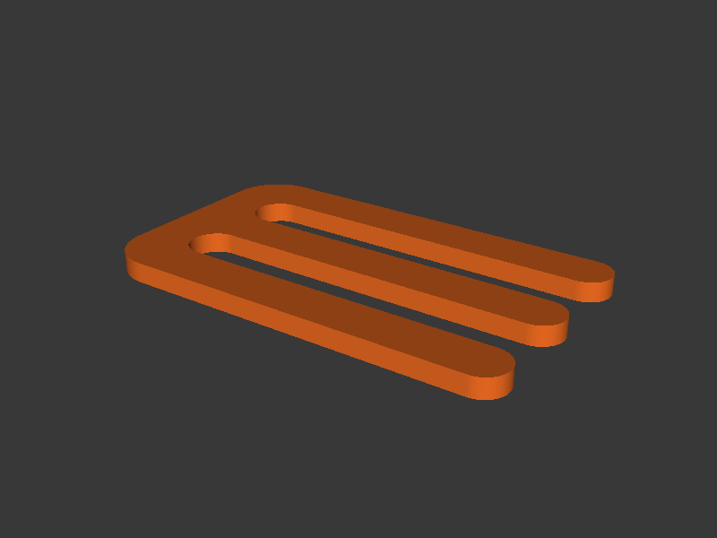

# Volumetric Flow



Generates a serpentine wall specimen, slices it in spiral vase mode, and
injects progressively increasing print speeds to determine the maximum
volumetric flow rate for a filament/hotend combination.

## Quick Start

Test PLA flow from 5 to 20 mm³/s in 1 mm³/s steps:

```bash
volumetric-flow \
  --start-speed 5 --end-speed 20 --step 1 \
  --no-upload --output-dir ./output --keep-files
```

Upload directly to printer:

```bash
volumetric-flow \
  --start-speed 5 --end-speed 20 --step 1 \
  --printer-url http://192.168.1.100 \
  --api-key YOUR_API_KEY
```

## How It Works

1. **Model generation** — CadQuery builds a serpentine (E-shaped) wall: three
   horizontal arms connected by a spine, with rounded ends. This creates a
   long continuous outer perimeter ideal for sustained extrusion testing in
   vase mode. The model height equals `num_levels * level_height`.

2. **Slicing** — PrusaSlicer slices in `--spiral-vase` mode (single wall,
   continuous Z rise) with a 5mm brim for adhesion.

3. **Feedrate insertion** — The G-code is walked line-by-line tracking Z
   height. At each level boundary, the feedrate on extrusion moves is
   overridden to achieve the target volumetric flow rate using the formula:
   `F = (flow_mm³/s / (layer_height * extrusion_width)) * 60`.

4. **Upload** — Same PrusaLink upload path as the temperature tower.

## Interpreting the Print

Print the specimen and observe where quality degrades — under-extrusion,
layer splitting, or extruder clicking indicate you have exceeded the maximum
flow rate. The last level that printed cleanly is your safe maximum volumetric
flow for that filament/hotend combination.

## CLI Reference

### Flow Options

| Flag | Default | Description |
|------|---------|-------------|
| `--start-speed` | *required* | Starting volumetric flow rate (mm³/s) |
| `--end-speed` | *required* | Ending volumetric flow rate (mm³/s) |
| `--step` | *required* | Flow rate increment per level (mm³/s) |

The flow range must be evenly divisible by `--step`, and the resulting number
of levels cannot exceed 50.

### Model Options

| Flag | Default | Description |
|------|---------|-------------|
| `--filament-type` | `PLA` | Filament type — sets nozzle temp, bed temp, and fan speed from preset |
| `--level-height` | `1.0` | Height per flow level in mm |

### Nozzle Options

| Flag | Default | Description |
|------|---------|-------------|
| `--nozzle-size` | `0.4` | Nozzle diameter in mm — derives layer height and extrusion width (see below) |

### Slicer Options

| Flag | Default | Description |
|------|---------|-------------|
| `--nozzle-temp` | from preset | Nozzle temperature (deg C) — overrides preset |
| `--bed-temp` | from preset | Bed temperature (deg C) — overrides preset |
| `--fan-speed` | from preset | Fan speed (0--100%) — overrides preset |
| `--layer-height` | from `--nozzle-size` | Slicer layer height in mm (default: nozzle × 0.5) |
| `--extrusion-width` | from `--nozzle-size` | Slicer extrusion width in mm (default: nozzle × 1.125) |
| `--config-ini` | | PrusaSlicer `.ini` config file |
| `--prusaslicer-path` | auto-detect | Path to PrusaSlicer executable |
| `--printer` | `COREONE` | Printer model — auto-sets bed center/shape and embeds printer metadata in bgcode |
| `--bed-center` | from `--printer` | Bed centre as X,Y in mm (auto-set by `--printer`) |
| `--extra-slicer-args` | | Additional PrusaSlicer CLI args (must be last) |

Supported printers for `--printer`: **COREONE**, **COREONEL**, **MK4S**
(alias: MK4), **MINI**, **XL**.

### Printer Options

| Flag | Default | Description |
|------|---------|-------------|
| `--printer-url` | | PrusaLink URL (e.g. `http://192.168.1.100`) |
| `--api-key` | | PrusaLink API key |
| `--no-upload` | `false` | Skip uploading to printer |
| `--print-after-upload` | `false` | Start printing after upload |

### Output Options

| Flag | Default | Description |
|------|---------|-------------|
| `--output-dir` | temp dir | Directory for output files |
| `--keep-files` | `false` | Keep intermediate STL and raw G-code |
| `--ascii-gcode` | `false` | Output ASCII `.gcode` instead of binary `.bgcode` |
| `--config` | auto-detect | Path to a TOML config file |
| `-v`, `--verbose` | `false` | Show detailed debug output |

## Examples

PLA flow test with fine steps:

```bash
volumetric-flow \
  --start-speed 5 --end-speed 15 --step 0.5 \
  --no-upload --output-dir ./output
```

PETG flow test with custom temperatures:

```bash
volumetric-flow \
  --filament-type PETG \
  --start-speed 3 --end-speed 12 --step 1 \
  --nozzle-temp 240 --bed-temp 80 \
  --no-upload
```

With a 0.6mm nozzle (auto-sets 0.3mm layer height, 0.68mm extrusion width):

```bash
volumetric-flow \
  --start-speed 5 --end-speed 20 --step 1 \
  --nozzle-size 0.6 \
  --no-upload
```

Use a PrusaSlicer profile:

```bash
volumetric-flow \
  --start-speed 5 --end-speed 20 --step 1 \
  --config-ini ~/PrusaSlicer/my_profile.ini \
  --no-upload
```
